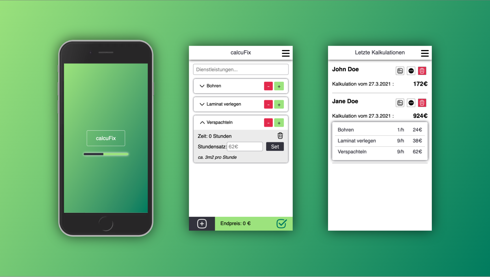

# calcuFix

calcuFix is a app thats meant to help small buisnessowners for getting their cost estimates done faster.
Often it´s hard to figure out at first sight, how much a work will cost. With this app, you can fully customize and add your working services to a shopping cart. At the end you get result based on youre services and their costs.

[View as mobile dummy](https://display-app-frame.vercel.app/)
[App in Browsersize](capstone-project-zeta.vercel.app)

## Installation and usage

This project was bootstrapped with Create React App. Further tooling:

    Styled-components
    Storybook
    Jest and testing-libary
    Axios
    Cypress

## Running the project

You can clone my repository with:

HTTPS:
$ git clone https://github.com/RBN2208/capstone-project.git

SSH:
$ git clone git@github.com:RBN2208/capstone-project.git

## Available Scripts

In the project directory, please run:

npm install

## Preview

